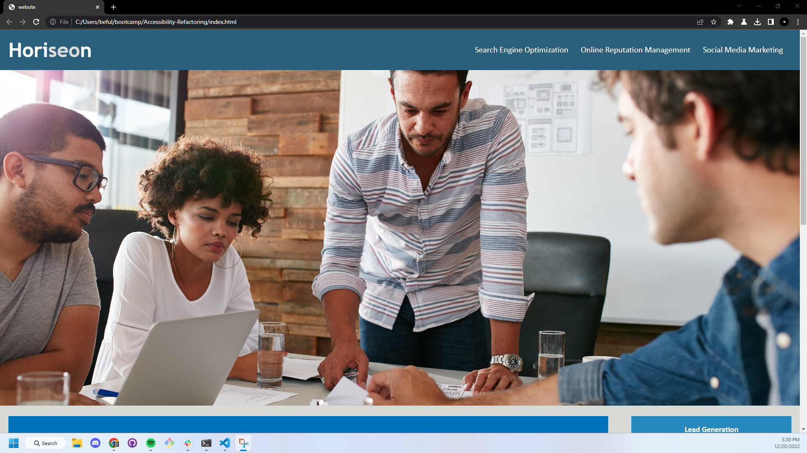
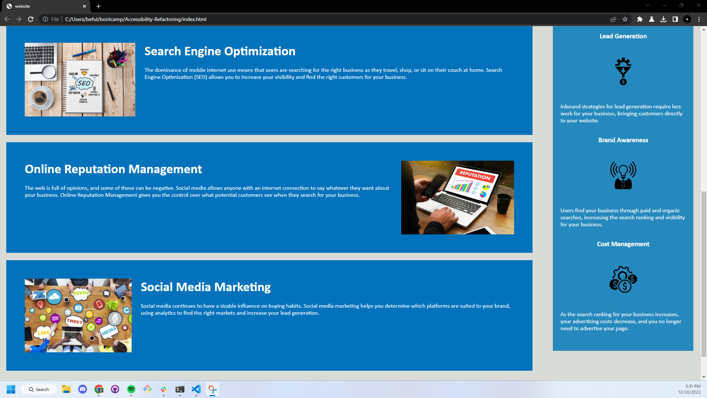

# Accessibility-Refactoring

## Description
Condensed css as well as added semantic html tags to a pre-existing website.

## Dependencies
internet access, A browser.

## Installation
N/A

## Authors
© 2019 Horiseon Social Solution Services, Inc.

Blayne Fuller

## Version History
0.4 - Added CSS comments 
0.3 - Added Semantic HTML 
0.2 - Condensed CSS 
0.1 - Commited Starter Code 

## License
This project is not licensed

## Screenshots of application 

